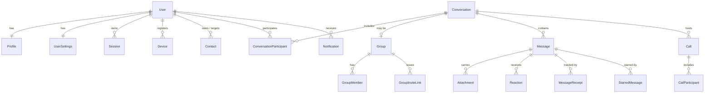

# NovaChat — Database

NovaChat uses **PostgreSQL** as the primary datastore (via **Prisma ORM**) and **Redis**
for ephemeral state (presence, pub/sub fan-out for the WebSocket layer, and caching).

The canonical schema lives in [`backend/prisma/schema.prisma`](../backend/prisma/schema.prisma).
This folder documents the data model and operational concerns.

## Entity overview

| Domain        | Models                                                                 |
| ------------- | ---------------------------------------------------------------------- |
| Identity      | `User`, `Profile`, `UserSettings`                                      |
| Auth          | `Session`, `Device`, `OtpToken`                                        |
| Social graph  | `Contact`                                                              |
| Conversations | `Conversation`, `ConversationParticipant`, `Group`, `GroupMember`, `GroupInviteLink` |
| Messaging     | `Message`, `Attachment`, `Reaction`, `MessageReceipt`, `MessageDeletion`, `StarredMessage`, `PinnedMessage`, `MessageEditHistory`, `Mention` |
| Polls         | `Poll`, `PollOption`, `PollVote`                                      |
| Scheduling    | `Draft`, `ScheduledMessage`                                          |
| Engagement    | `Notification`, `Call`, `CallParticipant`                             |
| Security      | `AuditLog`                                                           |

## Entity-relationship diagram



## Design notes

- **Soft delete semantics for messages.** "Delete for me" creates a `MessageDeletion`
  row scoped to a user; "delete for everyone" flips `deletedForEveryone` so the row is
  preserved for audit but rendered as a tombstone.
- **Receipts** are modelled per-recipient (`MessageReceipt`) to support group read
  receipts, while a denormalised `Message.status` gives a cheap "best status so far".
- **Privacy** controls (`lastSeenPrivacy`, `profilePhotoPrivacy`, `bioPrivacy`) live on
  `Profile` and are enforced in the service layer.
- **Indexes** are defined on hot read paths: `Message(conversationId, createdAt)`,
  `Message(conversationId, deletedAt)`, `Message(expiresAt)`,
  `ConversationParticipant(userId, isArchived/isPinned)`, and presence lookups on `User`.
- **Optimistic locking** — `Message.version` is incremented on every edit via a
  conditional update, so concurrent edits fail fast instead of silently overwriting.
- **Soft delete** — `Message.deletedAt` retains rows for audit/history while hiding
  them from normal reads; `deletedForEveryone` renders a tombstone.
- **Audit trail** — `AuditLog` records every state-changing request (actor, action,
  resource, method/path/status, IP, user agent) for compliance and security review.

## Migrations

```bash
# create + apply a dev migration
npm --workspace backend run prisma:migrate

# apply migrations in production (no prompts)
npm --workspace backend run prisma:deploy

# seed demo data
npm --workspace backend run prisma:seed
```

## Redis keyspace

| Key                              | Purpose                                  | TTL      |
| -------------------------------- | ---------------------------------------- | -------- |
| `presence:user:{userId}`         | Online flag + socket count               | 60s      |
| `presence:lastseen:{userId}`     | Last-seen timestamp                      | none     |
| `typing:{conversationId}`        | Set of users currently typing            | 10s      |
| `cache:conversation:{id}`        | Cached conversation metadata             | 300s     |
| `socket:user:{userId}`           | Set of active socket ids                 | none     |
